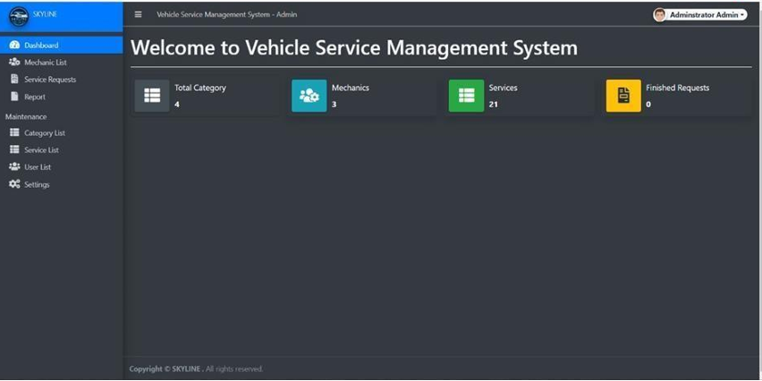
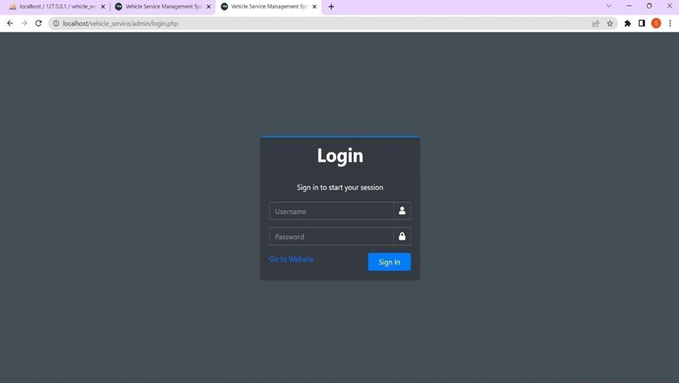
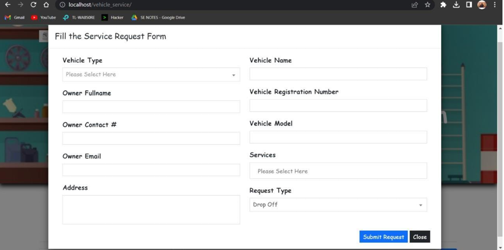
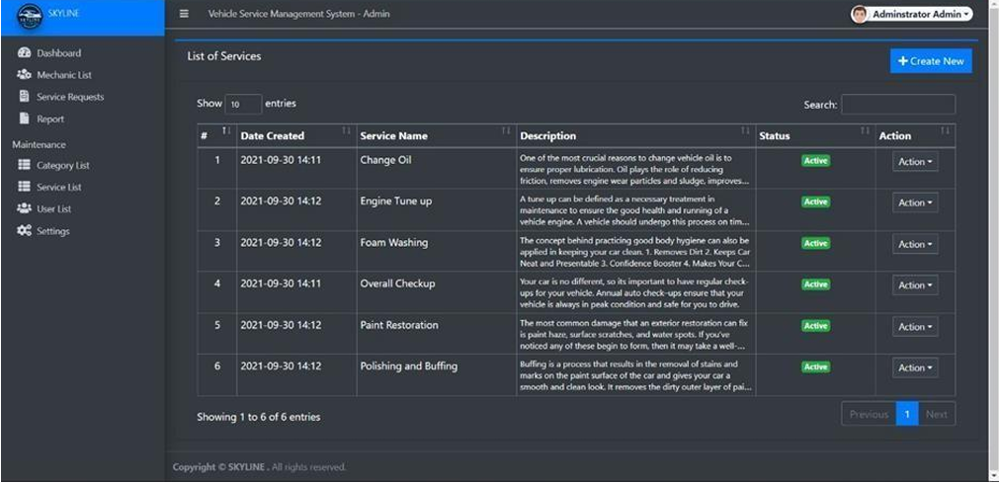
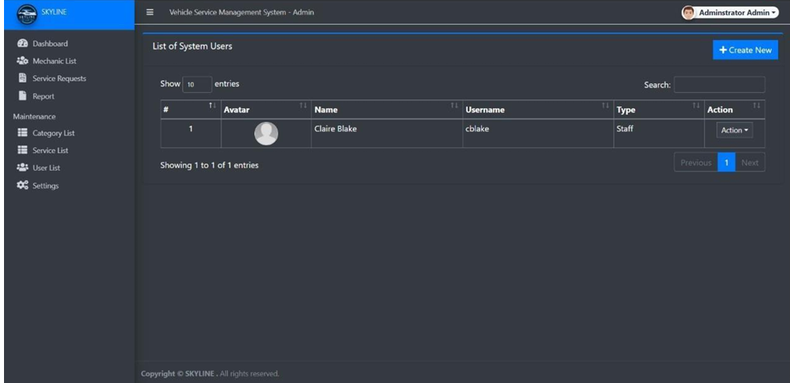
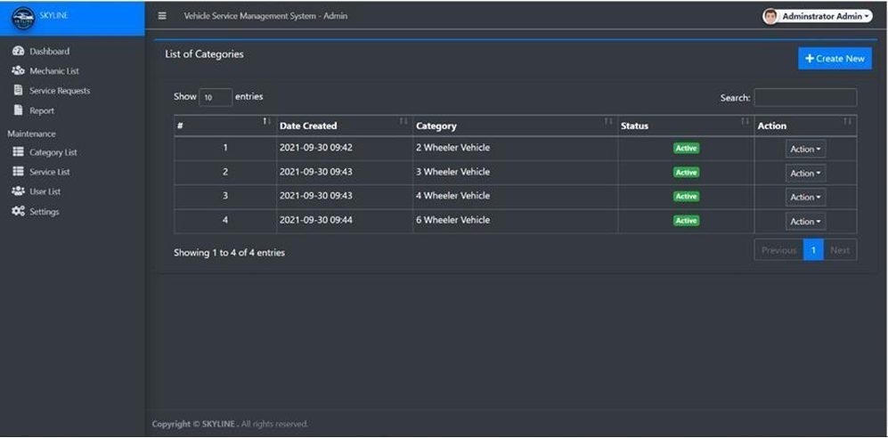

# 🚗 Vehicle System Management

A web-based Vehicle Management System developed using PHP and MySQL.  
This project helps manage vehicles, service requests, and booking details efficiently through a simple user interface.

---

## 📌 Features

- 🔐 User Login System  
- 🚘 Add & Manage Vehicles  
- 🛠️ Service Request Handling  
- 📋 View Service Bookings  
- 📊 Dashboard Overview  
- 🗂️ Organized Data Management using MySQL  

---

## 🛠️ Tech Stack

This project is built using the folling technologies:

- Frontend: HTML, CSS, JavaScript 
- Backend: PHP  
- Database: MySQL  
- Server: XAMPP  

---

## 📁 Project Structure

- `index.php` – Main entry point  
- `config.php` – Database configuration  
- `send_request.php` – Handles service requests  
- `view_service.php` – Displays bookings  
- `vehicle_service/` – Core project files  

---

## ⚙️ How to Run

1. Install XAMPP  
2. Move project folder to `htdocs`  
3. Start Apache & MySQL  
4. Open browser and go to:
http://localhost/vehicle-system-management

---

## 📸 Screenshots

### Dashboard

### Login Page

### Add Vehicle / Form

### Service List

### Vehicle List

### General List View

---

## 👩‍💻 Author

Rakshita

---

## ⭐ Notes

This is a beginner-friendly full-stack project demonstrating CRUD operations, database connectivity, and basic system design using PHP.
